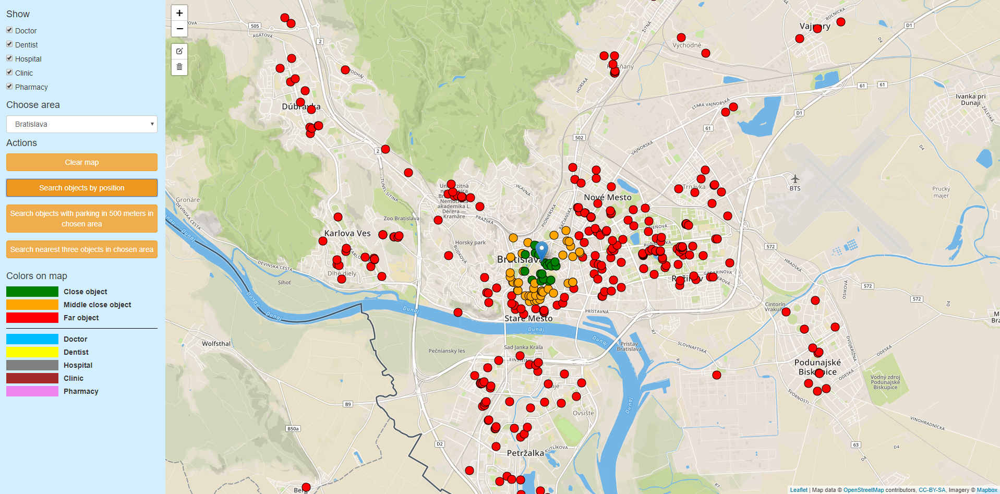
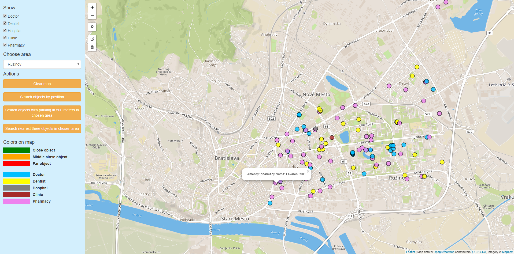

# General course assignment

Build a map-based application, which lets the user see geo-based data on a map and filter/search through it in a meaningfull way. Specify the details and build it in your language of choice. The application should have 3 components:

1. Custom-styled background map, ideally built with [mapbox](http://mapbox.com). Hard-core mode: you can also serve the map tiles yourself using [mapnik](http://mapnik.org/) or similar tool.
2. Local server with [PostGIS](http://postgis.net/) and an API layer that exposes data in a [geojson format](http://geojson.org/).
3. The user-facing application (web, android, ios, your choice..) which calls the API and lets the user see and navigate in the map and shows the geodata. You can (and should) use existing components, such as the Mapbox SDK, or [Leaflet](http://leafletjs.com/).

## Example projects

- Showing nearby landmarks as colored circles, each type of landmark has different circle color and the more interesting the landmark is, the bigger the circle. Landmarks are sorted in a sidebar by distance to the user. It is possible to filter only certain landmark types (e.g., castles).

- Showing bicykle roads on a map. The roads are color-coded based on the road difficulty. The user can see various lists which help her choose an appropriate road, e.g. roads that cross a river, roads that are nearby lakes, roads that pass through multiple countries, etc.

## Data sources

- [Open Street Maps](https://www.openstreetmap.org/)

# My project

**Application description**: Application shows on map various healthcare objects in Bratislava city. 
User have option to mark which objects he want to show on map (doctors, dentists, hospitals ect.).
Every shown object on map have popup with its own description. Shown objects are color separated.
There are three main usecases which can my application do:

1. Show on map healthcare objects and fill them with color based on how far they are from user position.
2. Show on map healthcare objects in chosen area (Ruzinov, Petrzalka ect.) which have nearby parking place.
3. Show on map three nearsets healthcare objects in chosen area (Ruzinov, Petrzalka ect.).

**Application screenshots**:

**Data source**: `Open street map`

**Technologies used**: `Java, Spring, Rest, HTML, CSS, Javascript, Ajax, Leaflet, Postgresql, Postgis`

**Application consits of three parts**: Client side - [Frontend](#frontend), Server side - [Backend](#backend), [Database](#database).
Application have build in Tomcat server which listen on address http://localhost:8080/ after run.

## Frontend
As a frontend there is one html file called index.html. 
This file contains leaflet widget which is responsible for managing map and left_panel which contains buttons responsible for mentioned functionalities (three usecases).
Buttons in left panel call ajax requests to the backend. Backend process these requests and answer to frontend with http POSTs which contains geojson data. 
Answer from backend (geojson data) is inserted to the leaflet plugin. Plugin afterwards paint result to the map.

## Backend
As a backend there is REST api written in language Java with framework Spring.
Api is making calls to database and format result to geojson.

**Api contains 3 REST services**:
1. searchFromPoint
	1. Service is responsible for 1 usecase.
	2. Http call for this service may loooks like this:
	
		`http://localhost:8080/searchFromPoint?doctor=true&dentist=true&hospital=true&clinic=true&pharmacy=true&point=LatLng(48.17135,%2017.06672)`
2. searchInArea
	1. Service is responsible for 2 usecase.
	2. Http call for this service may loooks like this:
	
		`http://localhost:8080/searchInArea?doctor=true&dentist=true&hospital=true&clinic=true&pharmacy=true&dropdown=0`
3. searchTriples  
	1. Service is responsible for 3 usecase.
	2. Http call for this service may loooks like this:
	
		`http://localhost:8080/searchTriples?doctor=true&dentist=false&hospital=false&clinic=true&pharmacy=true&dropdown=0`

## Database
As a database I choose PostgreSQL with extension Postgis. This extension is suitable for working with geo data.
I downloaded geo data from OpenStreetMaps and for importing I used osm2pgsql plugin. 

**Command for import**:

`osm2pgsql -S %pathToDefaultStyle% -l -U postgres -H localhost -W %pathToOsmFile%`

Data were imported with 4326 projection. Database contains just data from Bratislava city.

### Database queries
I made three databse queries, below is the ilustration of them:
1. Get all healtcare objects with selected amenity and count distance between them and user position.

~~~~
"SELECT ST_X (way), ST_Y (way), amenity, name, ST_DistanceSphere(st_makepoint(?,?), way)
FROM planet_osm_point
where " + amenity
~~~~

2. Get all healthcare objects with selected amenity in chosen area which have parking place closer than 500 meters.
	
~~~~
"SELECT ST_X (a.way), ST_Y (a.way), a.amenity, a.name 
FROM planet_osm_point as a 
where 
ST_Contains( ST_GeomFromText("+polygon+"),a.way) 
and (" +amenity+ ") 
and 
	(select ST_DistanceSphere(b.way, a.way) as distance 
	from planet_osm_point as b 
	where 
	b.amenity = 'parking' 
	or b.amenity = 'parking_entrance' 
	or b.amenity = 'parking_space' 
	order by distance ASC 
	limit 1)
< 500"
~~~~

3. Get three healthcare objects based on selected amenity in chosen area which are closest to each other.
	
~~~~
"WITH 			
pointA AS 
(SELECT a.osm_id, a.way
FROM planet_osm_point a 
WHERE 
ST_Contains(ST_GeomFromText("+polygon+"), a.way) 
	and a.amenity = '"+amenity.get(0)+"'
),
pointB AS 
(SELECT b.osm_id, b.way
FROM planet_osm_point b 
WHERE 
ST_Contains(ST_GeomFromText("+polygon+"), b.way) 
	and b.amenity = '"+amenity.get(1)+"'
),
pointC AS 
(SELECT c.osm_id, c.way
FROM planet_osm_point c 
WHERE 
ST_Contains(ST_GeomFromText("+polygon+"), c.way) 
	and c.amenity = '"+amenity.get(2)+"'				
), 
crossAB AS
(select pointA.osm_id as pointA_id, pointA.way as pointA_way, pointB.osm_id as pointB_id, pointB.way as pointB_way,	ST_DistanceSphere(pointA.way, pointB.way) as distanceAB 
from pointA 
cross join pointB 
order by distanceAB asc				
),
finalResult AS
(select crossAB.pointA_id, crossAB.pointB_id, pointC.osm_id as pointC_id, crossAB.distanceAB, crossAB.distanceAB + ST_DistanceSphere(crossAB.pointA_way, pointC.way) as trol 
from crossAB 
cross join pointC
order by trol asc 
limit 1
)				
select ST_X (way), ST_Y (way), amenity, name 
from planet_osm_point
where osm_id = (select pointA_id from finalResult) or
osm_id = (select pointB_id from finalResult) or
osm_id = (select pointC_id from finalResult)"
~~~~

